A list of the best tools I discovered while developing the [Sync Tab Groups](https://github.com/Morikko/sync-tab-groups) extension and how to use them. The tools simplify and improve my coding experience. The tools are compatible with both Firefox and Chrome.

 on [Unsplash](https://unsplash.com?utm_source=medium&utm_medium=referral)](./asset-1)

### **Control the browser session**

#### Motivation

The first thing to prepare is the browser environment. I don’t recommend to use your day to day session. When you develop, you do mistakes that could break the extension in your session or corrupt your data (bookmarks, open tabs…).

#### Create a tailor-made browser session

The best tool so far for the web extension ecosystem is called [web-ext](https://github.com/mozilla/web-ext). It opens a browser with a temporary session and your extension already installed. The browser is configurable to open some pages on start and to change the settings. This tool accepts both a configuration file and line parameters.

An example of a web-ext configuration to store your browser environment as code

The change of the settings was very useful when the hidden tab API was still experimental in Firefox 59. The opened browser was compatible with the extension without any additional manual operation.

A useful page to open is the `about:debugging` page in order to have access to the extension options.

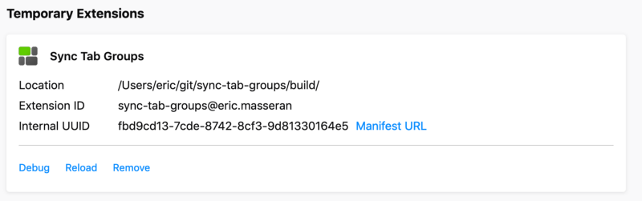

You can use the extension to open some extension URLs like the options or some test pages. If you are looking for a solution, you can read the “Automatically open the page” section [from this previous blog post](https://medium.com/@Morikko/testing-your-web-extension-with-integration-tests-f875f1f52ff9).

#### Chrome compatibility

I found no equivalent tool for Chrome. You have to use a manual method. You can change the session by using another “_people_”. The menu is at the top right of the Chrome browser window.

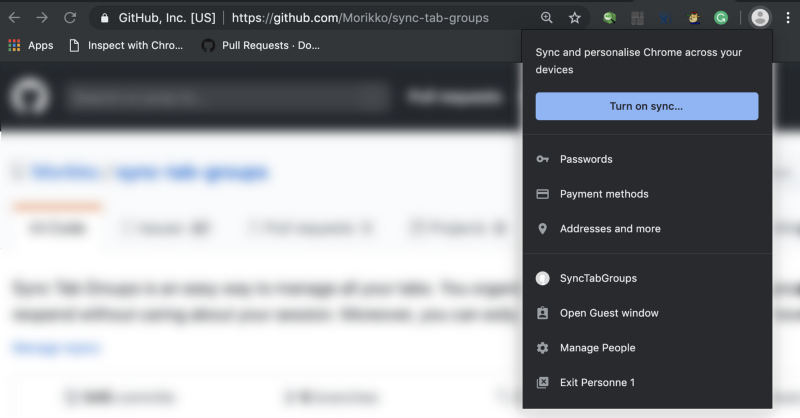

[An issue](https://github.com/mozilla/web-ext/issues/809) has been open in the web-ext repository to add an option to open Chrome instead of Firefox. The feature [is already in progress](https://github.com/mozilla/web-ext/pull/1392), we hope it is for soon.

### Lint your extension

[web-ext](https://github.com/mozilla/web-ext) not only controls the browser session but also embeds a linter. The linter checks the compliance with the web extension standard. By using `npx web-ext lint`, you can know if your manifest respects the standards. If the extension doesn’t meet the standards, it is rejected by the browser store. In order to avoid back and forth with the store, the linter warns you about your problems. In my cases, it helped me a lot to anticipate errors in the `manifest.json` and in the `JSON language files`.

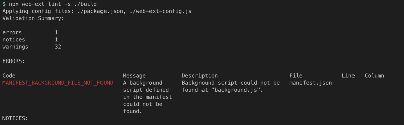

The linter works only on the build version of the extension if you use Webpack. More especially, it only makes sense to lint the production version. The Webpack compilation often lets `DANGEROUS_EVAL` and `UNSAFE_VAR_ASSIGNMENT`. It is not a problem to use and release the extension with those warnings.

### Translate your extension

The process to translate an extension and keeping the translation up to date could be tremendous. The translations are often not done by the developers and are not correlated with the release cycle. I developed a tool called `[Translate Web-Ext](https://morikko.github.io/translate-web-extension/help)` to simplify the process.

The 3 pillars are:

-   Setup easily: Fetch the language files over the internet
-   Stay focus: Get feedback about the translations to do
-   Start immediately: Translate everything from within the browser

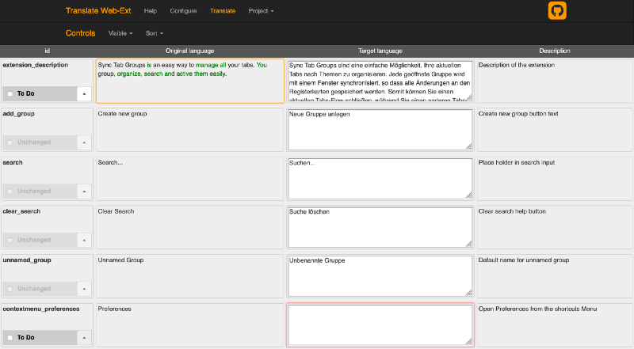

#### Simple

The interface abstracts the JSON syntax. On top of that, `[Translate Web-Ext](https://morikko.github.io/translate-web-extension/help)` gives you feedback about the changes. The new or changed fields are highlighted. Also, the words that changed are colored.

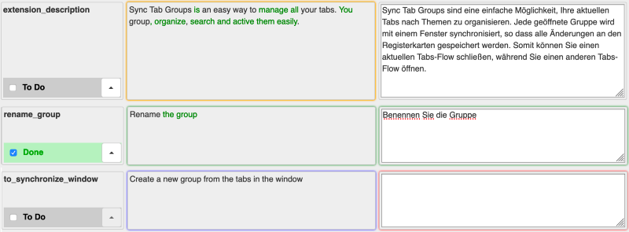

Once you are satisfied with a new translation you can mark it as done. In the end, you just have to download the JSON file with the translations inside. The downloaded file is ready to be consumed by the extension.

#### Setup

In order to work the translation app needs some previous JSON language files.

-   The original text to translate (mandatory)
-   The previous translation in order to not start from zero (optional)
-   The original text at the previous translation time to see the changes (optional)

For the extension developer side, in order to use `[Translate Web-Ext](https://morikko.github.io/translate-web-extension/help)`, you have only to make the JSON translation files available on the internet. It works like a charm with the repositories in `Github`.

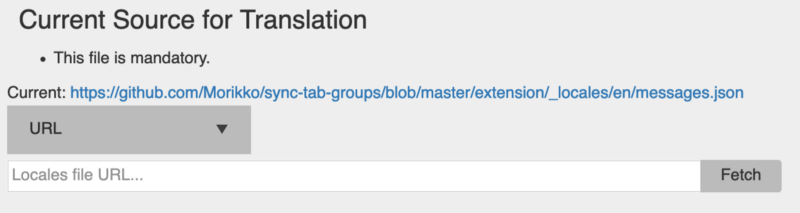

Any doubt, click on [this link](https://morikko.github.io/translate-web-extension/translate?headoriginal=https://github.com/Morikko/sync-tab-groups/blob/master/extension/_locales/en/messages.json&baseoriginal=https://github.com/Morikko/sync-tab-groups/blob/v0.6.0/extension/_locales/en/messages.json&basetarget=https://github.com/Morikko/sync-tab-groups/blob/v0.6.0/extension/_locales/de/messages.json) to see the translation interface in action. It is the German translation process for an extension I am developing called [Sync Tab Groups](https://github.com/Morikko/sync-tab-groups). The link sets in advance the language files to fetch, so your translators don’t bother with configuration. The base translation, the last one done, is at the tag v0.6 in GitHub. Whereas the targeting translation is the English one in the last release (master).

In the help section, you can find additional information on how to use `[Translate Web-Ext](https://morikko.github.io/translate-web-extension/help)` and an URL generator with the configured language files.

#### How to easily test a language setting

First, you should use the linter from web-ext to verify the file format is fine. Then, I prefer to use Chrome (or Chromium) to test the interface impact. The reason is that it is easier to change the language setting so that the extension is in another language.

By developing on Linux, I could change the language like this `LANG=es chromium &`. Alternative solutions are proposed [in this StackOverflow thread](https://stackoverflow.com/questions/24992240/start-google-chrome-with-a-specific-locale-using-a-command-line-argument) if the previous solution doesn’t work. On Mac, the only solution that worked for me was to change the language in the OS settings.

### Support both Chrome and Firefox

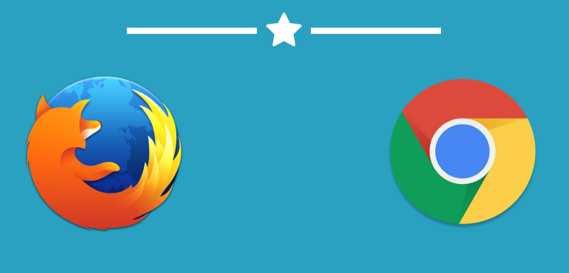

#### Same code for all your browser extensions

[Web Extension Polyfill](https://github.com/mozilla/webextension-polyfill) is a helpful library for Chrome. It creates a `browser` object bound to the `chrome` object. The goal is to write the extension only with the `browser` object. Then, it works on both the Firefox and Chrome browsers.

You might ask why it is useful as Firefox understands already the `chrome` object well. The reason is the `browser` object API uses Promises instead of callback. Although callback can do the job, Promises with `async` / `await` are pleasant to use.

#### API differences

Today, Firefox has many more features than Chrome (hidden tabs, open discarded tabs, set window/tab variables…). Check the [Mozilla documentation](https://developer.mozilla.org/en-US/docs/Mozilla/Add-ons/WebExtensions) to know which feature is available on which browser and since which version.

When I develop the extension [Sync Tab Group](https://github.com/Morikko/sync-tab-groups), for targeting both browsers, I have 2 solutions:

1.  Share the same code and dynamically disable the missing feature at execution
2.  Limit the feature to the more restricted browser

As an example for the second point, I limited the commands (extension keyboard shortcuts) in the manifest to 4. It is the maximum value allowed in Chrome. Another example, on the client side this time. For my popup interface,  I stopped using the [menuitem API](https://developer.mozilla.org/en-US/docs/Web/HTML/Element/menuitem) and switch to a homemade menu.

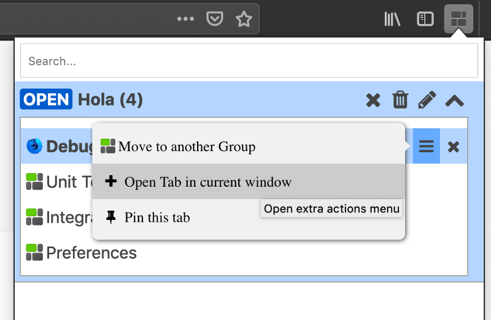

#### Behavior changes

Not only does the API differ but also the engine is different. Here, just a few hints on Chrome behaviors:

-   `browser.tabs.remove` could resolve the promise before the tab is really removed
-   Extension tabs are always closed on extension uninstallation/reload even if they don’t contain a call to the `browser` API
-   `activated` event is triggered before the `close` one for windows

### Tests

Testing is a core strategy for keeping quality code and to be sure the application knowledge is hardcoded into the repository.

If you are familiar with test libraries like [Jest](http://jestjs.io/) or [Jasmine](http://jasmine.github.io/), you can use them with the [sinon](https://github.com/sinonjs/) package. The package mocks all the web extension API as none of the previous test frameworks understands this API.

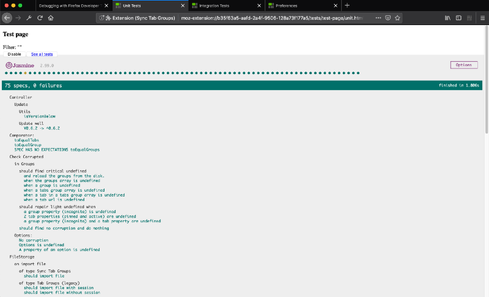

If you prefer to do real integration tests, you might embed a Jasmine test page into one of the web extension pages. Then you have access to the complete API and you can even bind the test page to the background script. If you are curious about all the best practices, you might enjoy [this article about how to do integration tests with your web extension](https://medium.com/@Morikko/testing-your-web-extension-with-integration-tests-f875f1f52ff9).

### Build your extension

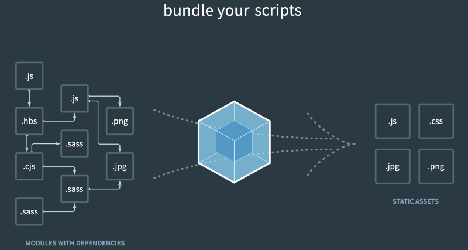

#### Description

Webpack is a most have to compile a complete JavaScript project. It manages for you the dependencies and transforms the code. It is usual to have at least 2 configurations: the development and production one. The development adds extra tooling and is more verbose whereas the production keeps only the essential and optimizes the code for speed against size and ease of reading.

The code transformations are interesting in:

-   The code to be compliant with older browser
-   Compiling the “client code” like the JSX format in React

#### Build the targets

A web extension is not always a single page app as there are at least a background script and an entry for each page (popup, side panel, tabs…). By default, Webpack builds a JavaScript file. If you want to template and bundle an HTML page, you should look at [html-webpack-plugin](https://www.npmjs.com/package/html-webpack-plugin).

Configure more than one entry with Webpack

In my extension I didn’t bundle directly HTML pages in order to control the CSS included and to import the `webextension-polyfill` library (the compiled version) before everything.

If you don’t include the polyfill library before any other code that calls the `browser` object, it crashes on Chrome. Another option is to import the browser object in each file (`import browser from "webextension-polyfill"`). Then Webpack adds and builds the necessary library.

#### Copy the static files

Many files are just assets for the extension, just copy them.

How to copy a bunch of assets with Webpack

#### Add your CSS

You could either import the CSS in the HTML pages like usually or you could import it directly in the JS code with `import ‘../css/font-awesome.scss’` . The drawback of the second method is that it duplicates the CSS in each JS target. In my project, I mostly used the first method for the CSS I wrote to avoid duplication and decrease the extension size. I only used the imported method for the `Font Awesome` library. Thus, I could add it as a dependency in the `package.json` and let Webpack building it for me.

How to compile css/scss files including the Awesome Font library

#### Import compiled libraries from the node\_modules

With Webpack and the plugin `copy-webpack-plugin` , you can even fetch the source from within the node\_modules folder. Thus, you can have access to compiled libraries directly importable by your web extension.

How to fetch some files directly in the node\_modules folder

### Debug hints

#### Global variable with Webpack

You can access the extension from the console, however, when Webpack builds the extension you lose the references.

A solution is to attach the function in the source code to the window like this `window.openTab = openTab;`. The function is then available in the console!

#### Set an environment variable with Webpack

A global variable is especially useful for knowing if you are in development mode. You can change the extension behaviors and verbosity.

Define a variable for your project with Webpack

#### Debug from VS Code

By default, each browser offers a debug console where you can interact with the extension. However, if you want to be closer to the source code and you use VS Code, you can use a debugger extension.

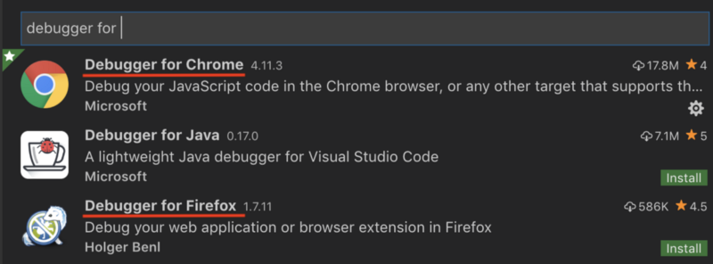

Follow the documentation of the specific debugger to know how to get the debug port and how to connect to it.

It works with Firefox, however, it used to bug after a short utilization. I never tried for a few months, so the situation could be better.

#### Use the source map to debug with Webpack

In order to retrieve the original source code line from within a web extension built with Webpack, you have to set this in the Webpack configuration `devtool: ‘inline-source-map’`.

Even if it is not the best recommendation from the [Webpack documentation](https://webpack.js.org/configuration/devtool/), only the “inline” type works on Firefox. Else the source map file is not found in the packaged extension. Other source map configurations seem to work on Chrome.

For more information, check the [Webpack issue](https://github.com/webpack/webpack/issues/1194) or the [web-ext issue](https://github.com/webextension-toolbox/webextension-toolbox/issues/58).

### Conclusion

I hope you enjoy the tools described in this article and that they help you to improve your coding experience. Not all of them might interest you now, just pick some and come back later if the need appears.

_All the tools here are implemented in the extension_ [_Sync Tab Groups_](https://github.com/Morikko/sync-tab-groups)_. I am still looking for contributors to help me developing the extension. :)_
