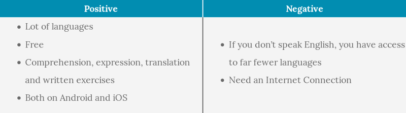
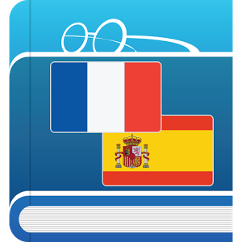
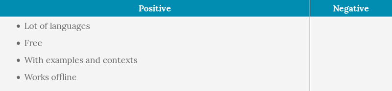
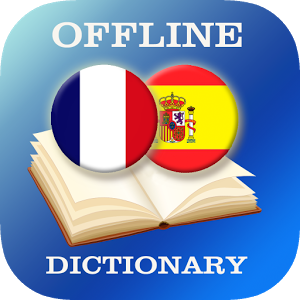
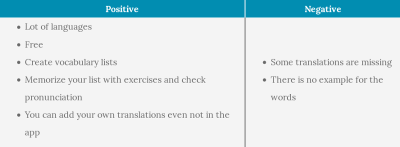
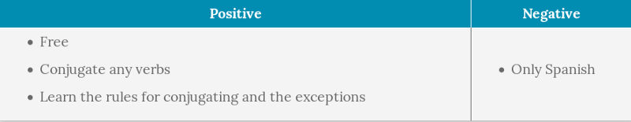

I have been around 9 months in Latino South America countries. All the time, I practiced and learned the Spanish language. I began the journey by knowing just a few words. And I ended the journey, by being fluent in Spanish.

This is my guide to learn a language while practicing and using smartphone applications (Android). This method is for people with great motivation and good autonomy. No one is going to push you except yourself! Also, in order to help you and go faster, you have to practice it regularly.

### Step 1: Start speaking

> _Discover a language and share more than a smile with locals._

This is usually the level you need for starting a conversation with people. You do basic and small sentences **with mistakes.** At the beginning, you speak often by adding words one after the other (like a baby), miming with other hands or using other language words. **Don’t worry you are learning**, you will make a lot of mistakes, that how your brain is getting better.

### Goals

-   Presenting yourself, asking information about the interlocutor
-   Basic verbs: drink, play, sleep…
-   And some vocabularies related
-   Pronoun and present tense

### Methods

Prefer to speak only with one person at a time. You will be more concentrated and avoid that the person will speak too fast with the others. **Don’t be afraid to ask the interlocutor to repeat or speak slower.** People that want to share won’t complain.

#### Practicing application

**I recommend you to start with Duolingo** (Or any other apps like this). However, Duolingo does it very well and **for free**.

#### Dictionary application

**Also download a dictionary**, so that you can always translate the unknown words. I used **Français-Espagnol Traduction from TheFreeDictionary.com — Farlex**.

### Step 2: Have normal conversation

> _Make stronger relationship with locals._

Once you are able to get the basics of a language, **it is time to speak normal conversation**. You will need more words, new tenses and more grammar rules. Also keep practicing, so that the language will be more familiar and you will be more confident to speak. However, as the skills are young **don’t be surprised if sometimes you are easily tired or overtaken by fast conversation**.

### Goals

-   Being able to have a basic conversation
-   Verbs and vocabulary about the daily life and your activities
-   Tenses: Present, future and past

### Methods

First, I still recommend you to practice daily with Duolingo in order to finish the language course. Nevertheless, **Duolingo will start to show its limits**. It lacks conversations, advanced vocabularies and complete conjugation learner.

For conversation, **the best way is to speak with other people, friends or unknown**. In the case you can’t, try to read (books or articles) or to watch videos. Duolingo is working hard on chatbots. They could be in a close future a nice alternative if you are not in the foreign country. Tough now, they are only available for few languages and in beta.

#### Words list application

As regards vocabularies, I encourage you to write the new vocabularies you used during conversation in a list. So, you can work on it later. Although a basic note application could be enough, I discovered one more convenient. **French-Spanish Dictionary from Alldict** is an application that proposes translations and allows you to **create lists of words you can practice with exercises.**

#### Conjugate application

In order to complete the practice with Duolingo, an application for conjugating is a must. You can check anytime for correcting yourself. I am using **Conjugate Spanish Verbs from Wasim Sandhu**. Not only conjugating, **the application provides a section with the rules for each tense**. Also very useful to **know all the irregularities in the conjugations**. An important point in Latin languages as most of the common verbs are irregular.

### Step 3: Speak fluently

> _Get almost completely integrated with the locals._

This part is probably the most challenging, as you need to work more on your own, speaking won’t be enough. It is closer to “school” exercises. You focus on advanced tenses and grammar rules you use less regularly. The next and final step would be to master the language almost like a native, a step I never reached except for my mother tongue.

### Goals

-   Having a conversation fluently with everybody
-   More advanced tenses: subjunctive, conditional…
-   Learn advanced grammar rules
-   Being able to debate and understand joke
-   Being careful to the pronunciation and accent
-   Getting the local expressions

### Methods

#### Learn languages rules

For this section, I used only websites although there is maybe an application. Many websites provide help and exercises for understanding languages rules, just choose the one you feel confident with. I found the rules to learn either when I encountered a doubt while speaking or just by surfing on the website. As for the words, keep a list of the grammar doubts you have. So that you can learn them later in a more relaxed way. Also, it can remind you which rules you are working on.

#### Increase your vocabulary potential

Most of the basic words are known but sometimes you face specific vocabulary or synonyms. My method to prepare yourself is to read (books or articles) as the vocabulary is more varied. Just add them in your words list like when you speak with someone. Reading or watching videos also help you to get language expressions instead of raw translations from your mother tongue.

#### The need of contact with people

For pursuing the progression and improving your integration. Depending the region, you will have to practice specific expressions and accents. Without someone to speak, this part is rather difficult.

### Step 4: Keep your skill up

> _Don’t lose your ability to speak a language for a future conversation._

This is hard to keep your language skills while not being in the country where to speak. I share with you all the ideas I got and already tried.

In any case, if you don’t use it now, maybe you don’t need it now. A language once learned is always easier to make it come back. After my 6 months gap between my Japanese classes and my internship in Japan, I needed to learn some basics again. However, thanks to my first learning effort, it came back in a quicker way.

#### Advises

-   Keep friends from visited places: read Facebook activity, call them…
-   Host travelers from Couchsurfing
-   Find events in Meetup or Facebook group
-   Make new friends in your country
-   Travel and speak on vacation
-   Read books and watch videos

### Remarks

#### About classes

Although I never spoke about classes in this article, classes can be very good. Actually, the 3rd step I described is really close to a work done in class. It is a way of having great feedback, keeping motivation and have a more formal approach. Also, you can meet other people for practicing.

Personally, I don’t like much language classes (maybe due to my bad experience in high school). However, instead, I used a lot my native friends as improvised teachers.

#### Spanish is too closed to French

I agree that I was greatly helped with my mother tongue in order to learn Spanish. However, I already made it with Japanese. I did 6 months in my Engineering School in France, 3 weeks with a hosting family and 4 weeks working in a company. At the end, I was able to have a basic conversation with anybody (Step 2). I remembered the writing part was more challenging, however, applications are also available for helping you.

#### No time recommendation

I didn’t do it intentionally. Learning is mostly depending on:

-   Methods
-   Workload
-   Similarity (It is harder to learn Japanese than Spanish for a Latin speaker)

Thus, it is impossible to provide specific time requirement. However, while practicing, you will quickly see that you are progressing.

---

_Originally published at_ [_travel.emasseran.org_](https://travel.emasseran.org/culture/learn-spanish-journey-south-america) _on October 10, 2017._
