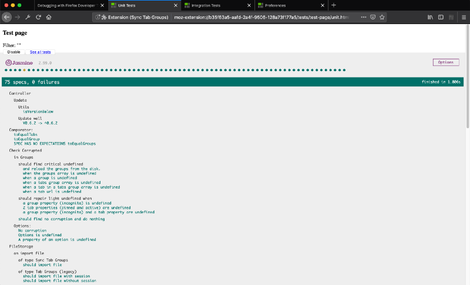
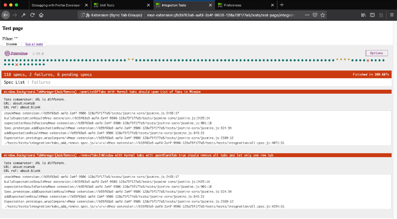
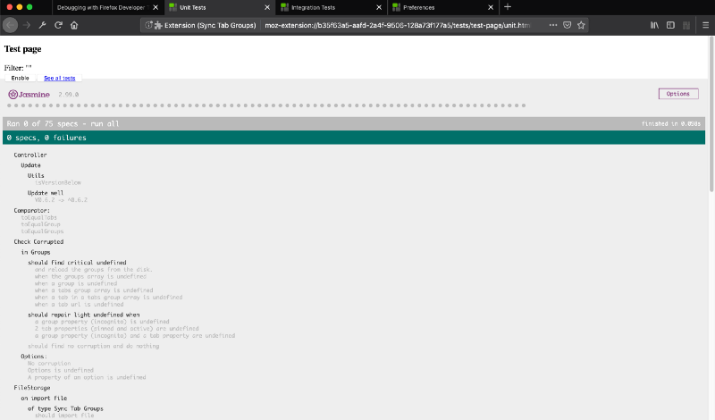
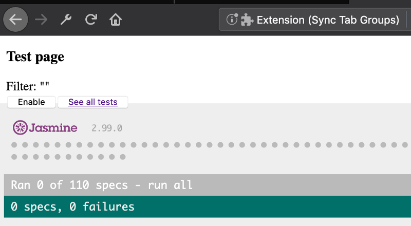
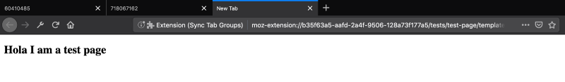
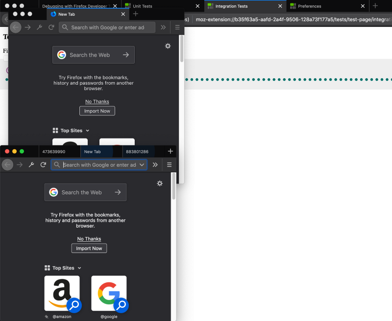

It is often described how to do unit tests for web extensions but hardly said how to do integration tests. Here, I am presenting the method to embed a Jasmine HTML page inside a page of your web extension.

### **The need of testing**

Testing is a core strategy in software development. It helps the developer to keep knowledge about the app and guarantee the code and the features keep their engagement.

When I started the extension [Sync Tab Groups](https://github.com/Morikko/sync-tab-groups), I first tested it manually. While it was working for the first weeks, I quickly felt I was losing time and getting less confident about each release. The day I released a critical bug was the signal.

Although pretty easy for testing React or Node, the web extension ecosystem is younger and less rich. The best approach, I found so far, is to mock the tests with [sinon](https://sinonjs.org/) and run them in a DOM emulation ([Jest](https://jestjs.io/) for example).

I decline this solution for 2 reasons:

1\. The library is not complete for Chrome and definitely lacks some Firefox specific features

2\. Mocked tests are useful and fast but not as safe as the integration tests

**Finally, by looking at the Jasmine library, I discovered I could embed my tests in an HTML page.**

### How to embed tests in a web extension page

In a web extension, the extension API is available on different parts

1\. In your background task

2\. On your extension pages

I started my small test library in the background task. I stopped immediately. Not only coding a library is tough but lacking a nice interface made it hard to iterate.

I quickly switched to the extension pages with the support of the [Jasmine](https://jasmine.github.io/) library. I downloaded all the HTML, JS and CSS files and added all my tests in “describe” and “it” blocks in the imported JS files.

If you use [Webpack](https://webpack.js.org/) to bundle your extension, you can even manage the Jasmine dependency. Webpack can create the test page by getting the assets from the `node_modules/`.

How to fetch the Jasmine assets and libraries directly from the node\_modules folder

### How to design your tests

While the concept is simple, I iterated regularly in order to improve the testing experience.

#### **Bind the web page to the background script**

By default, the web extension doesn’t access the full web extension API. A solution is to require the background window where the core of the extension is running.

Be careful, the function is asynchronous, thus, you should wait before executing any tests. When I added the Chrome support on [Sync Tab Groups](https://github.com/Morikko/sync-tab-groups), at first I forgot to wait. As a consequence, the tests were randomly failing.

Wait the background is bound before executing the onload event function

Note: all the code available in the article is coming from the [Sync Tab Groups repository](https://github.com/Morikko/sync-tab-groups).

#### Mock the timers

The window functions (“setTimeout”…) in the page are not the same than the ones in your background script. If you want to mock the time, you should modify the ones in the background object with the Jasmine mocked functions.

Replace the background script time functions with the mocked ones from Jasmine

#### Improve the test experience

One of the first pain I got was caused by the tests starting automatically each time the page was loaded. A solution is to overwrite the filter with a string that won’t match any test title. The filter is overwritten dynamically in order to not have strange URLs.

My second pain was to list all the tests. By using the previous solution that stops the test execution, you set the `enable` parameter to false. If you set to empty the URL `spec` parameter, then all the tests are listed in light gray. If the `spec` parameter is not empty, the page will only list the test titles that matched it.

The new Jasmine configuration to not start the tests when the page is loaded

This small interface on top of the Jasmine page helps to control the tests. By clicking on the “Enable” button the tests are executed on the next page refresh. Whereas “See all tests” button disables the test execution (the enable parameter to false) and resets the filter (the spec parameter to the empty value).

The JavaScript code to add the interface (some HTML code is also necessary)

#### Automatically **open the page**

Extension pages have often strange and unpredictable URLs. On top of that, they close each time you reload your extension. A nice solution is to add a system to automatically open pages when the extension starts (in the development mode of course). The web extension API provides a function to open a page from a local path without knowing the extension id.

Open some extension pages in development mode

It is easy to detect when the extension is under development thanks to the “temporary” property in Firefox. For Chrome, an alternative method based on the values of some fields is necessary as the “temporary” field is missing. Although it works, it shows a reality, Firefox works harder to make the extension developer life easier than with Chrome.

Detect if you are currently developing the extension

#### **Use mocked tabs**

When I first did my tests, I was using a random pool of real URLs for the tabs in my groups. When the number of the tests increased significantly, the test suite was taking longer and my computer was over computing.

Actually, loading a tab in your browser is an expensive task because of the graphical resources and the scripts (tracking, page interactions…). On top of that, if they open by ten without letting time for your computer to finish, the navigation is getting horrible.

A new solution using a custom (empty) web extension page solves the issue. It has 2 advantages:

1.  The tab is lighter to load (no images, no JavaScript)
2.  It is local to the extension, thus there is no network time

For some tests you want to differentiate the pages to know if a specific page does something. As the extension can’t change the HTML content at opening, you could use an URL parameter set with a random number. Be careful, it might have number collision leading to random failing tests. A better solution would be to store the number to avoid using a number more than one.

Since the mock tabs don’t use the network, it allows to develop the extension without an internet connection. A great improvement to code even on the train!

The code to create a mocked tab

#### **Create your toolbox to control the browser**

As the tests are running inside the UI browser, it might get difficult to follow the current test execution for debugging. For example, you might wish to look at the test states to know if some tests have already failed or how close the tests are from the end.

Another problem exists if you test features that use more than one browser window. You want to visualize the test running in all the browser windows to check everything is going well while you are writing it.

It is easy to use some web extension functions to resize the browser windows to fit better in the screen. You could change manually the setting to fit a single or double screen configuration.

Split the browser window on the half part of the screen

#### **And some insoluble problems…**

Whereas it is easy now to test a web extension with integration tests, some behaviors are still problematic

-   Some tests are failing in the Mac full screen mode (no idea why)
-   While the tests are running, you might not be able to use your computer as changing the focus could make the tests failing

### **Improvement ideas**

I just want to share with you some improvements I never tried because I run out of time.

#### **Headless Browser**

A pain that still remain is that during the tests my computer is unavailable. I read some things about [selenium](https://www.seleniumhq.org/), [puppeter](https://github.com/GoogleChrome/puppeteer) and [Firefox Headless mode](https://developer.mozilla.org/en-US/docs/Mozilla/Firefox/Headless_mode). However, I never tried! Also, the Firefox “[web-ext](https://github.com/mozilla/web-ext)” tool could even be a solution to do continuous integration.

#### **Remote testing**

I studied another solution I was never able to implement. [Mocha](https://github.com/mochajs/mocha) is a server for sharing your tests in the browser.

It works by opening a local server that gets connected by the browser in a tab. By continuously exchanging, the Mocha server is sending the tests are waiting for the responses.

The reason I gave up this solution, was due to the tab page was targeting the localhost and thus wasn’t an extension page. This involves you got access only to [a limited part of the API](https://developer.mozilla.org/en-US/docs/Mozilla/Add-ons/WebExtensions/API/tabs/executeScript) (not to the background script).

### **Conclusion**

By embedding the Jasmine test page into your web extension, you could use the agility of a test framework with the full power of the web extension API.

In my project [Sync Tab Groups](https://github.com/Morikko/sync-tab-groups), I was able to ensure all my features were truly working on the new releases. Independently of knowing if the web extension in the browser was changing. I used to release many times a week when I was only working on this project without regression.

By the way, I am still looking for contributors to help me developing [Sync Tab Groups](https://github.com/Morikko/sync-tab-groups). :)
