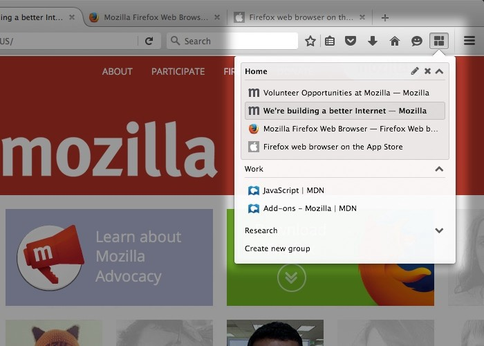
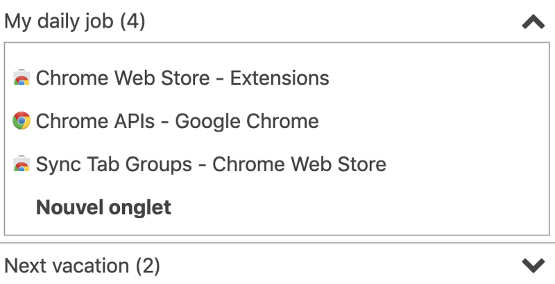

Sync Tab Groups is a browser extension to help you manage your tabs. You group the tabs by topic and then switch between those groups. After 6 months of intensive development, the extension was used by 4,500 users on Firefox and Chrome and rated 3,8 ★. This article tells the great adventure it was to design the extension, interact with the community and plan the strategies.

If you are more curious to understand the full potential of the Sync Tab Groups extension, you might check [the presentation video](https://www.youtube.com/watch?v=PI8TXaAv4_A) or read [the documentation website](https://morikko.github.io/synctabgroups/).

### Could I make it?

> A **browser extension** is a small [software](https://en.wikipedia.org/wiki/Software "Software") module for customizing a [web browser](https://en.wikipedia.org/wiki/Web_browser "Web browser"). Browsers typically allow a variety of extensions, including [user interface](https://en.wikipedia.org/wiki/User_interface "User interface") modifications, [ad blocking](https://en.wikipedia.org/wiki/Ad_blocking "Ad blocking"), and [cookie](https://en.wikipedia.org/wiki/HTTP_cookie "HTTP cookie") management.

[_Wikipedia definition_](https://en.wikipedia.org/wiki/Browser_extension)

#### Context

By the end of 2017, [Firefox migrated from the legacy extension system to a new web extension one](https://blog.mozilla.org/addons/2016/11/23/add-ons-in-2017/). The advantages were to have one standard with Chrome extension and to develop more easily. However, the migration cost was enormous and could kill extensions maintained by developers in their free time.

That happened with [Tab Groups](https://github.com/Quicksaver/Tab-Groups), the most famous extension on groups management used by thousands of users. The developer gave up because he should have written again all the code to the new system. And of top of that, Firefox didn’t provide all the features from the legacy systems. The important feature to hide tabs in the browser to quickly show them again was not anymore in the next Firefox version.

#### Concept

As of October 2017, there was still no extension to manage tabs on the new web extension system. As I was an enthusiastic user of Tab Groups, I needed a new extension. I decided to make a new one, Sync Tab Groups was born.

In the first version, I wanted to show a panel with all your groups and the ability to switch between them in your current browser window. In the historical Tab Groups extension, the management was done in another tab with a powerful interface. For simplicity, I used the extension [Simplified Tab Groups](https://github.com/denschub/firefox-tabgroups), that allows doing all the basic changes from within the menu panel. The basic changes are renaming/deleting/adding group and moving tabs.

As the feature to hide tabs was missing I had to use another method that closed the tabs and open new tabs each time.

#### First Release

I finally [released a working extension](https://addons.mozilla.org/en-US/firefox/addon/sync-tab-groups/) on mid-November 2017. Just on time when Firefox 57 was released and stopped supporting legacy extension.

The first days, many users like me were seeking a replacement for managing the groups. Sync Tab Groups was downloaded a lot, it motivated me.

Immediately, I received much feedback. The extension could be promising but it lacked features and it has still many bugs.

Also, some people complained about the incapacity to hide tabs that slow down the group switching (delayed by 4s). I felt sad even if I was not able to do anything about it. Hopefully, other reviews were encouraging.

The first feedback was clear. I had to correct the bugs and add some features to make this extension exceptional.

#### Improvements

Before the end of November 2017, I rushed to ship all the necessary features to make Sync Tab Groups daily usable.

-   Better incognito mode: incognito windows could be ignored and the incognito groups are automatically deleted once the window is closed
-   The Pinned Tabs could be part of the groups or ignored
-   Any open window could become a group or be ignored
-   Import your groups from the old Tab Groups extension
-   Add an options menu to configure your groups
-   Add a command to close a tab from the panel menu

### In search of the best extension

#### Features

From December 2017 to January 2018, I focused a lot on adding plenty of new features.

To select the features to develop, I used different channels. In the beginning, [the reviews on the extension store](https://addons.mozilla.org/en-US/firefox/addon/sync-tab-groups/reviews/?page=6) were the main sources for feedback. Once the community was better established, all the issues were centralized in [the issues section on GitHub](https://github.com/Morikko/sync-tab-groups/issues). I also set up an email and added [a contact page on the official website](https://morikko.github.io/synctabgroups/#contact) for users not familiar with Github. People contacted me a lot through the contact page, I received principally bug reports and encouragement.

I treated all the reported bugs whereas I was more selective concerning the features. Usually, either I was also interested in the feature or I expected at least 3 users to ask about it. If I would have taken all the requests supported by a single person, the extension would have diverged and been too complicated from the usage point of view and the technical conception.

#### Get lazy to be faster

Each time a group was open it open all the tabs belonging to it. Opening a tab is a very consuming operation. And even more when you open them by tens. Even a recent computer starts to struggle to respond quickly.

I heard about [another extension](https://github.com/sienori/Tab-Session-Manager/blob/9697e3fc322844aafc277a947bac8fcd6e4d9adf/Tab-Session-Manager/background.js#L407) that used a trick to save computation and open tabs in a faster way. The secret is to be lazy.

Instead of opening the tab with the real URL and loading the complete page, you use a custom extension page. This page is very light and thus fast to display. The template page is always the same, only the URL parameters changed to store the real page title, URL and icon. A tab open with this lazy page consumes nothing until it is focused the first time by the user. Then, a script in the page changes the URL to the targeted real page.

After there is an URL example, don’t mind if you can’t read it. The extension would open the page: [https://github.com/Morikko/sync-tab-groups/releases?after=v0.4](https://github.com/Morikko/sync-tab-groups/releases?after=v0.4)

_moz-extension://532be2ca-1072–754c-bbfa-806e694f6f89/tabpages/lazytab/lazytab.html?title=Releases %C2%B7 Morikko%2Fsync-tab-groups&url=https%3A%2F%2Fgithub.com%2FMorikko%2Fsync-tab-groups%2Freleases%3Fafter%3Dv0.4&favIconUrl=https%3A%2F%2Fgithub.githubassets.com%2Ffavicon.ico_

#### Protect your groups

The groups are the most important thing for a user. Any loss of data is critical and must be avoided.

The first release of Sync Tab Groups was very sensitive and it happened that some users (even me) lost some groups. I spent a lot of time to investigate and correct any faults. Aside, I put other strategies to protect the users’ groups.

The first back up system was based on the bookmarks. Regularly, the groups were saved in the user’s bookmarks. The principal inconvenient was that creating a bookmark was time-consuming and might freeze the browser for some configuration with many tabs (>100). After a few attempts, I gave up this solution and removed it completely.

I developed a new system based on 2 different targets: the extension internal storage and external storage. Both were done automatically by the extension.

The internal storage system took a snapshot of the groups up to a long time. It allows going back at some point if the groups are accidentally corrupt or if the user did a mistake.

The external storage system downloaded the groups on your computer to be out of the Firefox storage. When the new web extension system started, it was still buggy, a Firefox crash might flush all the extension storage. Thus, even the internal snapshots disappeared. This problem was so huge that even another developer I talked to, told me that he used [another storage available](https://developer.mozilla.org/en-US/docs/Web/API/IndexedDB_API) as something external and persistent.

### Design evolution

#### Colors

The first version lacked colors, it was only shades of gray. I decided to put some colors to make the interface more attractive. I chose the blue for no evident reason except that I already used it for some buttons. The first blue version embedded a very flashy blue, that could be more aggressive than attractive. Finally, I preferred another one more pastel.

The version you see above with the 2 shapes of blue interlaced was a prototype I never released. It was an attempt to highlight the difference between 2 consecutive groups.

#### Better highlight the tabs

In the beginning, rows for a group and a tab were similar except the icon visible in the second case. I often got the feedback that it was hard to find yourself among many groups and tabs. Thus, I surrounded the tabs in the same group with a border and added an offset to better highlight the difference with a group row.

#### Group states

While the open groups were colored for a long time, I created a button to tell which groups were visible in a window. It reduced the number of shades in the interface which in turns increased the visibility.

The active group is the group open in the active window. Also, for each group, there is an active tab, the one currently in use. After using a background color for the active group, I rather set the same style for the active tabs and group. They are both bold. A consistent interface is very important to help users.

Finally, I used a light background color while hovering a group or a tab.

#### Drag & Drop

Here some detailed screenshots about the design for drag and dropping tabs.

### Community

#### Documentation

After the community around Sync Tab Groups grew, I started taking an important part of my time to do support. Most of the time the feature was already present. But some users didn’t find it or didn’t understand how to use it well.

After repeating myself plenty of times on how to avoid to create a group when a new window is open or how to back up your groups, I decided to create documentation. First, I made some notes in [the wiki part of the repository](https://github.com/Morikko/sync-tab-groups/wiki).

Although it was a good start, the interface wasn’t enough attractive and the content still not enough explicit. So, I made the Sync Tab Groups website with [a presentation](https://morikko.github.io/synctabgroups/#presentation) and a [guide that explains the features](https://morikko.github.io/synctabgroups/#guide). Also, I [made a video about why and how to use Sync Tab Groups.](https://www.youtube.com/watch?v=PI8TXaAv4_A)

[!The Sync Tab Groups website](https://morikko.github.io/synctabgroups/)

#### About the community

The community was a powerful motivation to continue to push forwards the extension. On many issues, I counted on the other users to help me. For [better defining the incognito compatibility](https://github.com/Morikko/sync-tab-groups/issues/6), we defined together with the best behaviors. I also [received very precise bug reports](https://github.com/Morikko/sync-tab-groups/issues/98) and [quick feedback if the resolution was fully working](https://github.com/Morikko/sync-tab-groups/issues/2#issuecomment-346002136). Even sometimes for the next important features, I [did some beta testing like for the hiding tabs feature](https://github.com/Morikko/sync-tab-groups/issues/64).

However, if I loved to get users’ ideas, I quickly spot a lack. The new [issues with the _enhancement_ label](https://github.com/Morikko/sync-tab-groups/labels/enhancement) stacked faster than the resolved ones. What happened? A pattern I have often seen since in free open source software, many demands but few contributions. I believe the reason is that few people have the skills, the time and the motivation to contribute.

To end this section, some amazing encouragements I received:

> Dear Morikko,  
> Just a quick message to say THANK YOU for your awesome extension !!!  
> Have a great day

> Sync Tab Groups has changed my life in a very positive way.

> Thank you for your hard work on this extension. But you get it. Keep up your quality extension.

> Just — thank you — . I never took the time to leave a comment for any extension, but for this one, I had to.

### Better foundation

At the end of 2017, I realized that I struggled to release often without breaking features. Also, the developer experience was poor. As a result, I regularly took time to update the technical stack.

#### Tests

Only after one month of development, I started testing the extension. Unfortunately, with my junior experience, I decided to create my tools. As it was very demanding to develop, I ended having a poor tool and only a few tests.

Finally, I discovered [Jasmine](https://github.com/jasmine/jasmine), a solution used by many developers and stronger. Thanks to the Jasmine Standalone, I was able to deeply test the extension. If you want to know more about the technical details, I wrote [an article on how to write tests for the web extensions](https://medium.com/@Morikko/testing-your-web-extension-with-integration-tests-f875f1f52ff9).

Thanks to all the tests, I was more confident at each release. After, I never released again a version with a big breaking bug.

#### Architecture

_This section needs technical skills, you might skip it_

To code faster, increase readability and reduce the bugs, I embraced regularly new coding features. Only a few weeks after I started, I discovered the async/await functions thanks to [an invalid bug I reported](https://bugzilla.mozilla.org/show_bug.cgi?id=1416573). I immediately switched all the codebase. Also, I firstly used the React library without the JSX feature because I based Sync Tab Groups on another extension that did so. When the interface became more complex, it was harder to iterate. With JSX, I was able to write the interface almost as if it was HTML tags.

During 2018, I discovered Webpack. I migrated to write the web extension like any modern JavaScript project. Then, I was able to update the packages more easily and to add a linter. The linter helped me a lot to spot bugs at code writing time.

I wrote [an article on how to build a web extension on top of Webpack](https://medium.com/@Morikko/developing-your-web-extension-with-the-best-tools-213207c2b6b5) to benefit from the best tools.

### Translate the extension

#### An international usage

Only half of the users were English, thus the extension should be translated for the accessibility. If it was easy to do the French translation, I could hardly do something for Russian or German.

Thanks to [external contributors](https://github.com/Morikko/sync-tab-groups/tree/v0.8.2#credits), Sync Tab Groups has been translated to Russian, Spanish, German, French and Taiwanese.

The first translation is always straight forward to do as you have to translate everything. Whereas, the next time you should analyze all the translations to find the one to add, delete or update.

#### Translate Web-Ext

[!The interface helps you to translate an extension with relevant insights](https://morikko.github.io/translate-web-extension/configure)

I made [a small web app called Translate Web-Ext](https://morikko.github.io/translate-web-extension/configure) to help the translators for doing their great jobs. The application, stored on Github, manages all the data locally on your computer.

It only takes the [JSON translation files](https://github.com/Morikko/sync-tab-groups/blob/v0.8.2/extension/_locales/en/messages.json), at least the one with the original language. If you provide, previous translation states Translate Web-Ext provides interesting insights. It tells you which field is new or deleted (automatically removed) and highlights the text differences between the previous and actual version.

You can set the translation files with the URL parameters. So, if they are stored on Github, you can create links already configured to make the translator life easier. [Check the Sync Tab Groups examples](https://github.com/Morikko/sync-tab-groups/tree/v0.8.2#translation) (choose a language and click).

### The last hottest features

#### The “brother” Chrome

One of the reason for Firefox to switch to the new web extension system is to be compliant with Chrome. I took this opportunity to make Sync Tab Groups compatible with Chrome.

I expected a short amount of work to bring compatibility. However, even if Firefox respects the web extension standards, they added much more features quickly to create an even better extension. On the opposite, Chrome has not a policy to improve the possibilities with the web extension. Hence, the Chrome version had to avoid those features making the code more complex.

Another surprise was some sneaky different behaviors between the Firefox and Chrome system. For example, the event triggering is not always call in the same order. Those differences increased the time I needed to develop the Chrome support.

I finally released [the Sync Tab Groups Chrome version](https://chrome.google.com/webstore/search/tab%20groups) in March 2018. It supported all the features except the ones only possible in the Firefox system.

#### Hide again the tabs

Finally, due to the community pressure, Firefox added [the hidden tab API](https://developer.mozilla.org/en-US/docs/Mozilla/Add-ons/WebExtensions/API/tabs/hide) again on 2018. It was one of the most awaited features and [many users helped me to beta test the implementation](https://addons.mozilla.org/en-US/firefox/addon/sync-tab-groups/) in Sync Tab Groups.

The biggest difficulty was to integrate this huge functionality in an extension also compatible with Chrome that doesn’t support it. The gap continued to widen between the Firefox and the Chrome version.

### Metrics

#### Users

#### Satisfaction

[!Chrome and Firefox reviews](https://addons.mozilla.org/en-US/firefox/addon/sync-tab-groups/reviews/)

### The end of a journey

All along the journey, I learned a lot on how to manage a project, to design a tool and to develop a software.

But finally, in April 2018, I started a new job as a backend developer at [Doctrine](https://www.doctrine.fr/). Although I continued the first months to contribute to Sync Tab Groups, I quickly understood that it was consuming a lot of my free time. Also, the extension reached the state where it satisfied my daily utilization at home and work. So, I had no strong reason to continue the extension development.

I don’t say that the extension is perfect neither it has all the features, but now I would appreciate getting some help from other developers. My incapacity to attract other developers in the development is my biggest regret in this adventure.

For the Firefox version, I plan to migrate the users to another similar extension: [Simple Tab Groups](https://addons.mozilla.org/en-US/firefox/addon/simple-tab-groups/). As regards to the Chrome version, I haven’t found any similar extension with enough potential yet.

### Thank you

I thank all the people that help me translating the extension or reporting issues. And of course, this adventure was amazing thanks to all the great community behind, that is still using the extension.

**I stay available for helping everybody that would like to contribute to the extension or take the ownership of the project.** [**The repository is accessible for everyone willing to fork it**](https://github.com/Morikko/sync-tab-groups)**.**

#### Sync Tab Groups ❤
